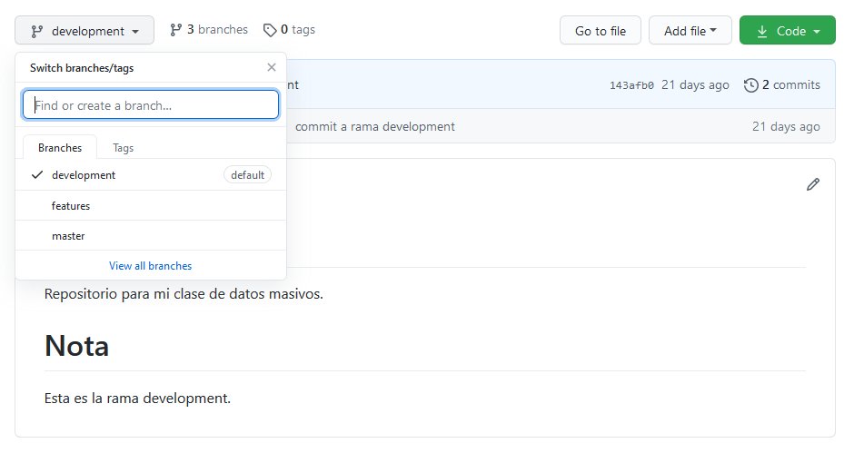
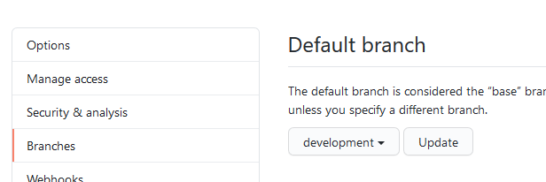
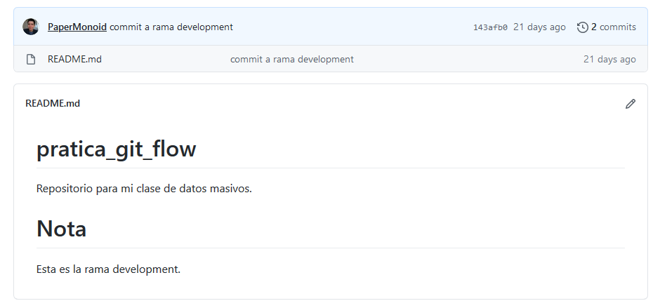
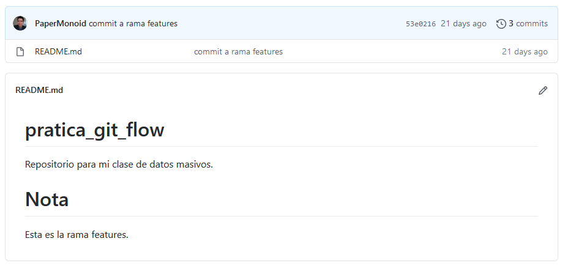

Introduction
------------

Git is a program that allows us to maintain version control when software is being developed by saving small incremental changes.

The way git works is that you have a remote repository and the developers clone the project to another location locally. The developers then make changes to the local repository with the add and commit commands, and then upload the changes to the remote repository with the push command.

In git there is the concept of branches, a branch is a sequence of changes that have been made in a repository and this concept is fundamental to the way gitflow works.

In gitflow a new branch is made when a new functionality is being developed in a project. Once that functionality is finished developing and all the commits related to that requirement have been made, then all the changes are applied to the main branch with the merge command. In this way the main branch does not have incomplete functionalities and developers can work on different functionalities without affecting the work of others.

Body
----------

In this practice, a simple gitflow example was made in the github repository [PaperMonoid/pratica_git_flow] (https://github.com/PaperMonoid/pratica_git_flow) with three branches: master, development and features.

The first step was to create the branches and upload them to the remote repository with the commands shown below.

|

$ git checkout -b development

$ git push origin development\
$ git checkout -b features

$ git push origin features

 |

Then the development branch was established as the main branch.

A change was made in the README.md of the development branch and a commit and a push was also made so that the changes were reflected in the repository.

A different change was made in the README.md of the features branch and a commit and a push was also made so that the changes were reflected in the repository.

Conclusion
----------

This practice helped me to practice the gitflow way of working and helped me reinforce my knowledge of the git tool.